# GLOW 🌟

### **General Local Offline Windows-agent**

<div align="center">


**An intelligent, vision-first Windows automation assistant powered by cutting-edge AI**

[Features](#-key-features) • [Installation](#-installation) • [Usage](#-usage) • [Architecture](#-architecture) • [Configuration](#%EF%B8%8F-configuration)

</div>

---

## 🚀 What is GLOW?

GLOW (General Local Offline Windows-agent) is an **autonomous AI assistant** that can see, understand, and control your Windows PC. Unlike traditional automation tools, GLOW uses **vision-first AI** to understand what's on your screen, make intelligent decisions, and execute complex multi-step workflows—all through natural language commands.

### 💡 Why GLOW?

- **🎯 Vision-First:** GLOW can actually "see" your screen using AI vision models, understanding charts, images, code, and UI elements
- **🤖 Fully Autonomous:** Chain multiple actions together automatically—analyze a chart, summarize findings, create a document, all from one prompt
- **🔗 Smart Result Chaining:** Results from one step automatically flow to the next, no manual intervention needed
- **92+ Tools:** Comprehensive Windows automation covering file management, browser control, Office apps, AI tasks, and more
- **🎨 Beautiful GUI:** Modern PyQt6 interface with an aesthetic glowing orb design
- **🧠 Multi-Model Support:** Works with Groq, Gemini Vision, Claude, OpenAI, and local Ollama models

---

## ✨ Key Features

### 🔍 Vision-First Automation

```
User: "Look at my screen, analyze this chart, and save a summary to report.txt"

GLOW:
  ✓ Takes screenshot with Gemini Vision
  ✓ Analyzes chart data and trends
  ✓ Summarizes key findings with AI
  ✓ Creates file with actual analysis (not placeholders!)
```

### 🎯 Intelligent Task Execution

- **Multi-Agent Architecture:** Planner → Executor → Verifier
- **Context-Aware:** Remembers conversation history and previous actions
- **Adaptive Planning:** Adjusts strategy based on what it sees on screen

### 🛠️ Comprehensive Windows Control

| Category               | Examples                                                  |
| ---------------------- | --------------------------------------------------------- |
| **File Operations**    | Create, move, delete, search, compress files              |
| **Browser Automation** | Search Google, open websites, click elements visually     |
| **Office Apps**        | Type into Word/Excel live, create documents, enter data   |
| **AI-Powered Tools**   | Summarize text, optimize code, analyze screens, translate |
| **System Control**     | Manage windows, monitor resources, control volume         |
| **Vision Tools**       | OCR, intelligent clicking, screen analysis                |

### 🎨 Live Typing

Watch GLOW type into applications character-by-character:

```
"Open Word and write a professional email about AI trends"
→ Word opens → Text appears live → You see it being typed!
```

---

## 🏗️ Architecture

GLOW follows a **human-inspired architecture** with specialized components working together seamlessly.

### 🎯 System Architecture Overview


### 🔄 Complete Execution Flow


### 👁️ Vision-First Loop (Detailed)


### 🧠 Multi-Agent Orchestration


### 🔧 Tool Execution Workflow


### 📊 Data Flow Through System

```mermaid
graph LR
    subgraph "Input Data"
        A1[Voice Audio]
        A2[Text Command]
        A3[Screenshot]
    end

    subgraph "Processing"
        B1[STT → Text]
        B2[LLM → Plan JSON]
        B3[Vision API → Analysis]
    end

    subgraph "Storage"
        C1[Memory Store]
        C2[Step Results<br/>$step1_result<br/>$step2_result]
        C3[Context History]
    end

    subgraph "Execution"
        D1[Tool Functions]
        D2[System APIs]
        D3[External APIs]
    end

    subgraph "Output Data"
        E1[Tool Results]
        E2[Files Created]
        E3[GUI Display]
        E4[Speech Audio]
    end

    A1 --> B1
    A2 --> B2
    A3 --> B3

    B1 --> B2
    B2 --> C1
    B3 --> C1

    C1 --> C2
    C1 --> C3

    C2 --> D1
    C3 --> D1

    D1 --> D2
    D1 --> D3

    D2 --> E1
    D3 --> E1
    E1 --> C2
    E1 --> E2
    E1 --> E3
    E3 --> E4

    style C2 fill:#4A90E2,stroke:#2E5C8A,color:#fff
    style D1 fill:#51CF66,stroke:#2B8A3E,color:#fff
    style E1 fill:#FFD43B,stroke:#FAB005,color:#000
```



---

## 📁 Directory Structure

```
Project-GLOW/
│
├── 🎨 body/                    # Visual interface components
│   ├── glow_orb.py             # Floating orb GUI
│   └── __init__.py
│
├── 🧠 brain/                   # Intelligence & planning
│   ├── multi_agent_system.py  # Core orchestrator
│   ├── vision_first_orchestrator.py  # Vision-guided execution
│   ├── groq_planner.py         # Fast planning with Groq
│   ├── gemini_planner.py       # Google Gemini integration
│   ├── gemini_vision_planner.py # Vision-capable planner
│   ├── claude_planner.py       # Anthropic Claude integration
│   ├── llm_client.py           # Multi-model LLM client
│   ├── memory.py               # Conversation memory
│   └── agent_graph.py          # Agent workflow graphs
│
├── ✋ hands/                   # Automation tools (92 tools!)
│   ├── ai_tools.py             # AI-powered utilities
│   ├── browser_tools.py        # Web automation
│   ├── coding_tools.py         # Code management
│   ├── intelligent_vision.py   # Vision-guided automation
│   ├── os_tools.py             # File & OS operations
│   ├── productivity_tools.py   # Office apps, email
│   ├── vision_automation.py    # Screen reading, OCR
│   ├── windows_tools.py        # Window management
│   └── __init__.py             # Tool registry
│
├── 👂 ears/                    # Input processing
│   ├── transcriber.py          # Speech-to-text (Whisper)
│   ├── wake_word.py            # Voice activation
│   └── __init__.py
│
├── 👄 mouth/                   # Output generation
│   ├── tts_engine.py           # Text-to-speech
│   └── __init__.py
│
├── 🎨 ui/                      # GUI components
│   ├── config_dialog.py        # Settings interface
│   └── __init__.py
│
├── 🔊 piper/                   # TTS models
│   └── models/
│       └── en_US-lessac-high.onnx.json
│
├── glow_app.py                 # Main GUI application ⭐
├── main.py                     # CLI application
├── config.json                 # Configuration file
├── requirements.txt            # Python dependencies
└── README.md                   # This file
```

---

## 🔧 Installation

### Prerequisites

- **Windows 10/11**
- **Python 3.10 or higher**
- **Git** (optional)

### Quick Start

1. **Clone the repository**

   ```bash
   git clone https://github.com/shivampal7405/glow.git
   cd glow
   ```

2. **Install dependencies**

   ```bash
   pip install -r requirements.txt
   ```

3. **Configure API keys**

   Edit `config.json` and add your API keys:

   ```json
   {
     "groq_api_key": "your-groq-key-here",
     "gemini_api_key": "your-gemini-key-here",
     "conversational_model": "Groq (Fast API)",
     "enable_vision": true
   }
   ```

4. **Run GLOW**
   ```bash
   python glow_app.py
   ```

### API Keys (Free Options Available!)

GLOW supports multiple AI providers:

| Provider         | Get Free API Key                                       | Best For                    |
| ---------------- | ------------------------------------------------------ | --------------------------- |
| **Groq** ⚡      | [console.groq.com](https://console.groq.com)           | Fast planning (recommended) |
| **Gemini** 👁️    | [ai.google.dev](https://ai.google.dev)                 | Vision analysis             |
| **OpenAI** 🤖    | [platform.openai.com](https://platform.openai.com)     | GPT-4 models                |
| **Anthropic** 🧠 | [console.anthropic.com](https://console.anthropic.com) | Claude models               |
| **Ollama** 🏠    | Local (no key needed)                                  | Offline usage               |

---

## ⚙️ Configuration

### config.json Structure

```json
{
  "conversational_model": "Groq (Fast API)",
  "groq_api_key": "gsk_...",
  "groq_model": "meta-llama/llama-4-maverick-17b-128e-instruct",

  "gemini_api_key": "AIza...",
  "gemini_model": "gemini-3-flash-preview",
  "enable_vision": true,

  "anthropic_api_key": "sk-ant-...",
  "anthropic_model": "claude-sonnet-4-5-20250929",

  "openai_api_key": "sk-...",
  "openai_model": "gpt-4o",

  "ollama_url": "http://localhost:11434",
  "ollama_model": "llama3.2",

  "whisper_model": "base",
  "tts_engine": "windows",
  "auto_listen": false,
  "wake_word_enabled": false
}
```

### Model Selection

Choose your AI model through the GUI:

1. Click **Settings** in GLOW
2. Select model from dropdown:
   - `Groq (Fast API)` - Fastest, recommended
   - `Gemini Vision (Live Vision)` - Best vision capabilities
   - `Claude (Anthropic)` - Most intelligent
   - `OpenAI (GPT-4)` - Balanced performance
   - `Ollama (Local)` - Fully offline

---

## 🎯 Usage

### Basic Commands

#### File & Folder Management

```
"Create a folder called 'AI Projects' on my desktop"
"Find all PDF files larger than 10MB"
"Delete the temp folder"
"Compress the Documents folder to a zip file"
```

#### Browser Automation

```
"Search Google for 'Python async programming'"
"Open YouTube and search for 'AI tutorial'"
"Click the first result"
```

#### Office Automation (Live Typing!)

```
"Open Word and type a professional email about quarterly results"
"Create an Excel spreadsheet with sales data"
"Open Notepad and write a TODO list"
```

#### AI-Powered Tasks

```
"Analyze this code on my screen and optimize it"
"Look at my screen, analyze this chart, save summary to report.txt"
"Summarize the text I'm reading"
"Translate this email to Spanish"
```

#### Vision-Guided Automation

```
"Look at my screen and extract the key points"
"Analyze the chart visible and create a summary"
"Read the code on screen and suggest improvements"
```

### Advanced Workflows

#### Research to Document

```
"Search YouTube for 'Top 5 AI trends 2025', read the titles of first 3 videos,
 then open Word and type a summary document. Save it as 'AI_Trends.docx' on my desktop."

What GLOW does:
  1. Opens Chrome → YouTube
  2. Searches for "Top 5 AI trends 2025"
  3. Uses vision to read video titles from screen
  4. Opens Microsoft Word
  5. Types summary live (you see each character!)
  6. Saves file to desktop with correct name
```

#### Screen Analysis to File

```
"Look at my screen, analyze any chart or data you see, summarize the key points,
 and create a report in 'analysis_report.txt'"

What GLOW does:
  1. Takes screenshot
  2. Gemini Vision analyzes chart/data
  3. Groq AI summarizes findings
  4. Creates file with real analysis
  5. Result: Actual insights, not placeholders!
```

#### Code Optimization Workflow

```
"Look at code on my screen, identify performance issues, optimize it,
 save as 'optimized_code.py', and open in VS Code"

What GLOW does:
  1. Screenshot → Vision AI sees code
  2. AI identifies inefficiencies (e.g., nested loops)
  3. Groq generates optimized version
  4. Saves to file with real optimized code
  5. Opens in VS Code automatically
```

---

## 🛠️ Available Tools (92 Total!)

<details>
<summary><b>📂 File & Folder Management (15 tools)</b></summary>

- `create_folder` - Create directories
- `delete_file` - Remove files
- `move_file` - Relocate files
- `copy_file` - Duplicate files
- `rename_file` - Change file names
- `read_file` - Read file contents
- `write_file` - Write to files
- `list_files` - List directory contents
- `search_files` - Find files by pattern
- `get_file_info` - File metadata
- `compress_files` - Create zip archives
- `extract_archive` - Extract compressed files
- `find_large_files` - Locate large files
- `empty_recycle_bin` - Clear trash
- `open_file_explorer` - Open folder in Explorer

</details>

<details>
<summary><b>🌐 Browser Automation (8 tools)</b></summary>

- `open_chrome` - Launch Chrome browser
- `search_google` - Perform Google search
- `open_youtube` - Search YouTube
- `click_first_result` - Vision-guided clicking
- `open_website` - Navigate to URL
- `search_web` - Generic web search
- `intelligent_chrome_search_google` - Vision-enhanced search
- `intelligent_chrome_click_first_result` - Smart clicking

</details>

<details>
<summary><b>📝 Office & Productivity (12 tools)</b></summary>

- `open_word` - Launch Microsoft Word
- `open_excel` - Launch Microsoft Excel
- `open_powerpoint` - Launch PowerPoint
- `create_word_document` - Create Word file
- `create_excel_spreadsheet` - Create Excel file
- `open_word_and_type` - Type into Word live
- `open_excel_and_enter_data` - Enter data live
- `open_notepad` - Launch Notepad
- `type_in_active_window` - Type text live
- `draft_email` - Create email draft
- `create_reminder` - Set reminder
- `list_reminders` - View reminders

</details>

<details>
<summary><b>🤖 AI-Powered Tools (13 tools)</b></summary>

- `analyze_screen_with_ai` - AI vision screen analysis
- `summarize_text` - AI text summarization
- `optimize_code` - AI code optimization
- `analyze_code_on_screen` - Screenshot code analysis
- `fix_code_errors` - AI debugging
- `explain_code` - Code explanations
- `improve_writing` - Writing enhancement
- `generate_email_reply` - Email generation
- `translate_text` - Language translation
- `generate_code` - Code generation
- `answer_question` - Q&A
- `brainstorm_ideas` - Creative ideation
- `extract_key_points` - Information extraction

</details>

<details>
<summary><b>🔍 Vision & Screen Tools (7 tools)</b></summary>

- `read_screen_text` - OCR text extraction
- `extract_text_from_image` - Image OCR
- `take_screenshot` - Capture screen
- `analyze_document_structure` - Document layout
- `check_screen_for_text` - Text detection
- `click_at` - Click coordinates
- `get_screen_resolution` - Display info

</details>

<details>
<summary><b>🖥️ System & Window Management (14 tools)</b></summary>

- `launch_application` - Start programs
- `get_active_window` - Current window info
- `list_all_windows` - All open windows
- `focus_window` - Activate window
- `minimize_window` - Minimize window
- `maximize_window` - Maximize window
- `close_window` - Close window
- `get_system_info` - System details
- `get_resource_usage` - CPU/RAM monitor
- `get_battery_status` - Battery info
- `lock_computer` - Lock screen
- `shutdown_computer` - Shutdown
- `restart_computer` - Restart
- `sleep_computer` - Sleep mode

</details>

<details>
<summary><b>⌨️ Keyboard & Mouse (10 tools)</b></summary>

- `type_text` - Keyboard input
- `press_key` - Single key press
- `hotkey` - Keyboard shortcuts
- `click_at` - Mouse click
- `get_mouse_position` - Cursor location
- `get_clipboard` - Clipboard read
- `set_clipboard` - Clipboard write
- `get_volume` - Audio level
- `set_volume` - Adjust volume
- `mute_volume` - Mute audio

</details>

<details>
<summary><b>💻 Development Tools (13 tools)</b></summary>

- `create_python_file` - Python files
- `run_python_script` - Execute Python
- `format_code` - Code formatting
- `check_syntax` - Syntax validation
- `install_package` - pip install
- `run_command` - Terminal commands
- `open_in_vscode` - VS Code integration
- `git_status` - Git repository status
- `git_commit` - Commit changes
- `git_push` - Push to remote
- `analyze_code_complexity` - Code metrics
- `find_code_issues` - Static analysis
- `refactor_code` - Code restructuring

</details>

---

## 🔬 Technology Stack

### Core Technologies

- **Python 3.10+** - Core language
- **PyQt6** - Modern GUI framework
- **PyAutoGUI** - Windows automation
- **Pillow (PIL)** - Image processing

### AI Models & APIs

- **Groq API** - Ultra-fast LLM inference (llama-4-maverick-17b)
- **Google Gemini** - Vision-capable AI (gemini-3-flash-preview)
- **Anthropic Claude** - Advanced reasoning (claude-sonnet-4-5)
- **OpenAI GPT** - General purpose AI (gpt-4o)
- **Ollama** - Local LLM support

### Specialized Libraries

- **google-generativeai** - Gemini integration
- **groq** - Groq API client
- **anthropic** - Claude API client
- **openai** - OpenAI API client
- **pyautogui** - GUI automation
- **pytesseract** - OCR (optional)
- **easyocr** - OCR fallback
- **whisper** - Speech recognition
- **pyttsx3** - Text-to-speech

---

## 📝 License

This project is licensed under the **MIT License** - see the [LICENSE](LICENSE) file for details.

---
